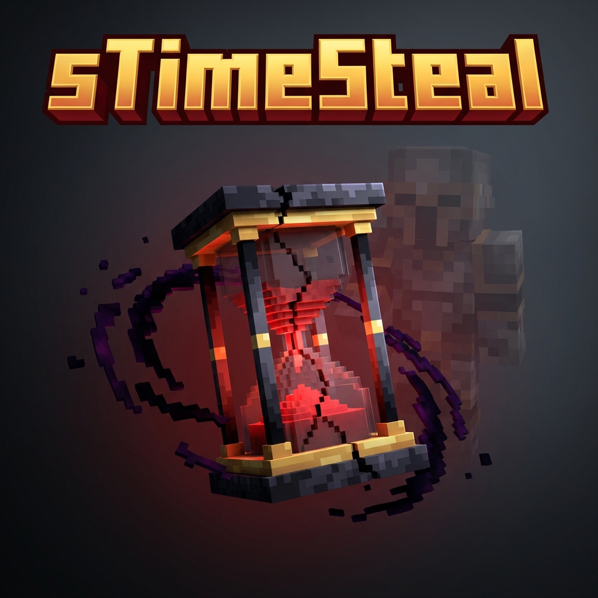

  
  <h1>sTimeSteal</h1>
  

    <strong>Time is your Life. Time is your Money.</strong>
  

  
  

    
    
    
  

---

## 📖 Overview
**sTimeSteal** is a hardcore survival plugin that transforms time into the most valuable resource on your server. Every second you play is a second of life spent. Run out of time, and you are **eliminated**.

Players must hunt others to steal their time, trade time using physical vouchers, or purchase hearts to extend their maximum survival capacity.

## ✨ Features

### ⚔️ Hardcore Time Mechanics
- **Time = Life**: Players have a countdown. When it hits 0, they are banned/eliminated.
- **PvP Stealing**: Kill a player to steal a portion of their remaining time.
- **AFK Protection**: (Optional) Configurable penalties for AFK players.

### 💰 Economy & Trading
- **Vouchers**: Convert your time into physical items (`/withdraw`) to trade with others.
- **Direct Pay**: Send time instantly to friends with `/paytime`.
- **Shop System**: Spend your hard-earned time to buy **Max Health** (Hearts) or other survival items.

### 🚑 Revival System
- **Revive Beacons**: Rare items that can be used to bring eliminated teammates back to the living world.
- **Revive GUI**: An intuitive interface to handle revivals securely.

### 🎨 Visual & Immersive
- **Action Bar HUD**: Real-time display of your remaining time, color-coded by urgency:
  - RED: Critical (< 1 Hour)
  - ORANGE: Warning (< 6 Hours)
  - GREEN: Safe (> 6 Hours)
- **Tab List Integration**: See everyone's status at a glance.

---

## 🛠️ Installation

1. Stop your server.
2. Download `sTimeSteal.jar` and place it in your `plugins/` folder.
3. (Optional) Install [Citizens](https://citizensnpcs.co/) if you want NPC shop integration.
4. Start the server.
5. Configure `config.yml` to your liking.

---

## 💻 Commands

| Command | Usage | Description | Permission |
| :--- | :--- | :--- | :--- |
| `/withdraw` | `/withdraw <minutes>` | Withdraw time into a physical voucher. | `None` |
| `/paytime` | `/paytime <player> <minutes>` | Send time to another player. | `None` |
| `/stimesteal`| `/stimesteal <subcommand>` | Main admin command (give/take time, reload). | `stimesteal.admin` |

## 🛡️ Permissions

| Permission | Description | Default |
| :--- | :--- | :--- |
| `stimesteal.admin` | Full access to admin commands. | OP |
| `stimesteal.revive` | Ability to use the Revive Beacon. | OP |

---

## ⚙️ Configuration
The `config.yml` allows you to tweak:
- Starting time for new players.
- Time gained per kill.
- Time lost on death.
- Input/Output messages.
- Revive Beacon settings.

---

## 🤝 Support
If you encounter any bugs or have feature requests, please open an issue on the GitHub repository.

  
Made with ❤️ by SiteSizer

